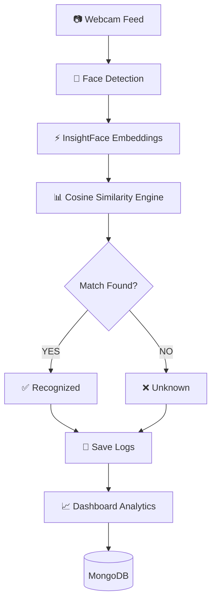
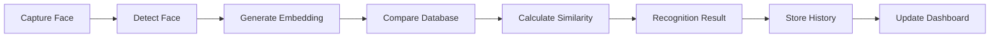

<div align="center">

# 👁️ AI Face Recognition Management System


<br>


<br>


<br><br>


</div>

---

# 🎥 Live Demo

<p align="center">


</p>

> Replace `assets/demo.gif` with your actual system recording.

---

# ⚡ Project Overview

An enterprise-grade AI-powered facial recognition platform capable of:

✅ Face Registration

✅ Real-Time Recognition

✅ InsightFace Embedding Extraction

✅ User Management

✅ Recognition Analytics

✅ Recognition History

✅ JWT Authentication

✅ MongoDB Integration

✅ Professional Dashboard

---

# 🏗️ System Architecture



---

# 🚀 Recognition Workflow



---

# 🛠️ Technology Stack

<p align="center">


</p>

---

# 📊 Core Features

| Module | Description |
|----------|-------------|
| 👤 Face Registration | Register and store users |
| 🎥 Live Recognition | Real-time face recognition |
| 📈 Analytics | Interactive charts and reports |
| 📝 History Logs | Recognition tracking |
| 👥 User Management | Manage registered users |
| 🔐 JWT Security | Protected authentication |
| ⚙️ Settings | Threshold & system controls |

---

# 🌟 Dashboard Preview

<p align="center">


</p>

---

# 📈 Analytics Preview

<p align="center">


</p>

---

# 🔥 Recognition Engine

```text
Webcam Stream
      ↓
Face Detection
      ↓
InsightFace Embeddings
      ↓
Cosine Similarity
      ↓
Recognition Decision
      ↓
Log Generation
      ↓
Analytics Dashboard
```

---

# 📂 Project Structure

```text
AI-Face-Recognition-System

├── backend
│   ├── controllers
│   ├── routes
│   ├── services
│   ├── models
│   ├── utils
│   └── app.py
│
├── frontend
│   ├── components
│   ├── pages
│   ├── hooks
│   ├── assets
│   └── services
│
└── README.md
```

---

# 🏆 Highlights

✨ Enterprise Dashboard

✨ Real-Time Face Recognition

✨ InsightFace AI

✨ MongoDB Integration

✨ JWT Authentication

✨ Interactive Analytics

✨ Professional UI

✨ Mobile Responsive

✨ Export Reports

✨ Production Ready

---

# 👨‍💻 Developer

### Rock

**Diploma in Electronics & Telecommunication Engineering**

Passionate about:

- Artificial Intelligence
- Computer Vision
- IoT Systems
- Embedded Systems
- Full Stack Development

---

<div align="center">


<br>


<br>

### ⭐ Star this repository if you found it useful!


</div>


